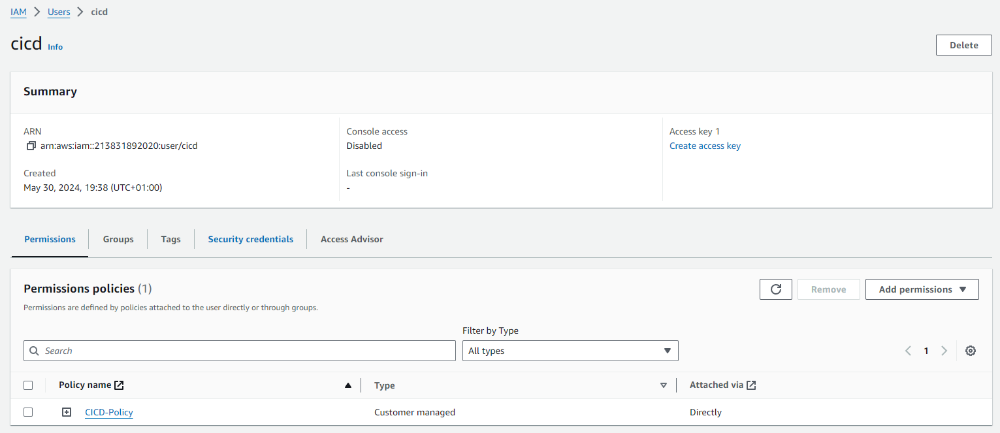
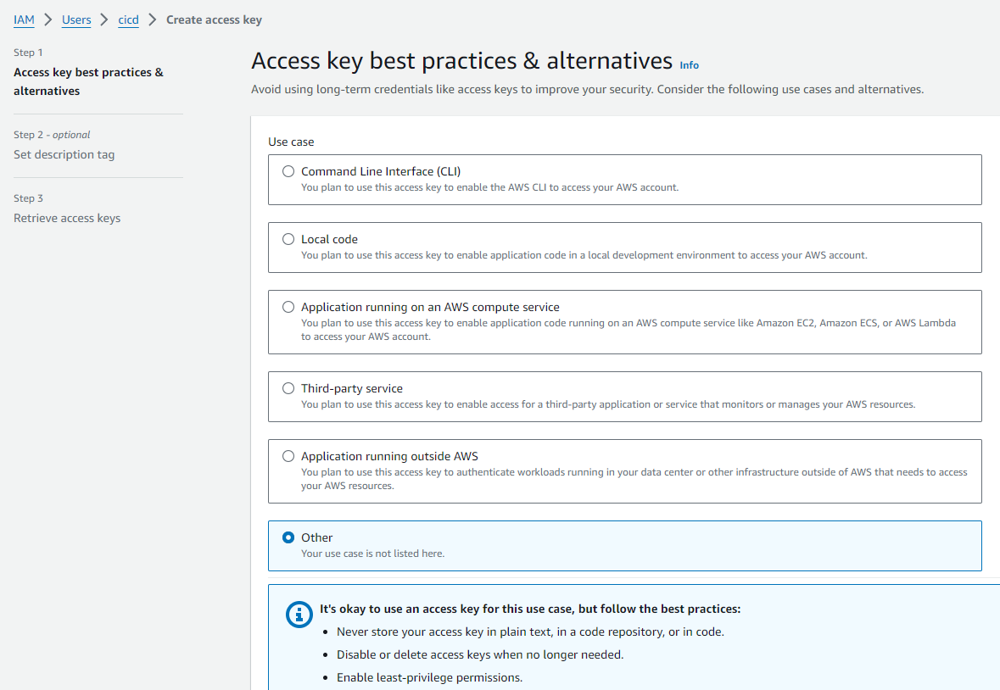

# Python AWS Lambda Template

This is a template for creating an AWS Lambda function with Python.

To set this up, you'll need an AWS account - this walkthrough assumes you have one already.

## Section 1: Obtaining AWS Credentials

### Step 1: Create AWS IAM Policies

1. Search for "IAM" and click on the "IAM" service.
2. Click on "Policies" in the left-hand menu.
3. Click on the "Create policy" button.


4. Click on the "JSON" tab.


5. Copy and paste the following JSON into the text area:

```json
{
	"Version": "2012-10-17",
	"Statement": [
		{
			"Sid": "ApiGatewayPermissions",
			"Effect": "Allow",
			"Action": "apigateway:*",
			"Resource": "*"
		},
		{
			"Effect": "Allow",
			"Action": [
				"cloudformation:DescribeStacks",
				"cloudformation:ListStackResources",
				"cloudwatch:ListMetrics",
				"cloudwatch:GetMetricData",
				"ec2:DescribeSecurityGroups",
				"ec2:DescribeSubnets",
				"ec2:DescribeVpcs",
				"kms:ListAliases",
				"iam:GetPolicy",
				"iam:GetPolicyVersion",
				"iam:GetRole",
				"iam:GetRolePolicy",
				"iam:ListAttachedRolePolicies",
				"iam:ListRolePolicies",
				"iam:ListRoles",
				"lambda:*",
				"logs:DescribeLogGroups",
				"states:DescribeStateMachine",
				"states:ListStateMachines",
				"tag:GetResources",
				"xray:GetTraceSummaries",
				"xray:BatchGetTraces"
			],
			"Resource": "*"
		},
		{
			"Effect": "Allow",
			"Action": "iam:PassRole",
			"Resource": "*",
			"Condition": {
				"StringEquals": {
					"iam:PassedToService": "lambda.amazonaws.com"
				}
			}
		},
		{
			"Effect": "Allow",
			"Action": [
				"logs:DescribeLogStreams",
				"logs:GetLogEvents",
				"logs:FilterLogEvents"
			],
			"Resource": "arn:aws:logs:*:*:log-group:/aws/lambda/*"
		},
		{
			"Sid": "CloudFormationPermissions",
			"Effect": "Allow",
			"Action": "cloudformation:*",
			"Resource": "*"
		},
		{
			"Sid": "CloudWatchLogsPermissions",
			"Effect": "Allow",
			"Action": "logs:*",
			"Resource": "*"
		},
		{
			"Sid": "S3Permissions",
			"Effect": "Allow",
			"Action": "s3:*",
			"Resource": "*"
		}
	]
}
```

6. Click next to review the policy, add a name and description, and click "Create policy".


### Step 2: Obtain Credentials for Programmatic Access to AWS

1. Search for "IAM" and click on the "IAM" service.
2. Click on "Users" in the left-hand menu.
3. Click on the "Create user" button.


4. Specify a user name.


5. Attach the policy you created in the previous step.


6. Click next to review the user, and click "Create user".

7. Click the user name to view the user details.



8. Click on the "Security credentials" tab.

9. Click on the "Create access key" button.


10. Select "Other" and click "Create".



11. Optionally, add a description and click "Create access key".

12. Click "Download .csv file" to download the credentials.


### Step 3: Store the Credentials in GitHub Secrets

1. Go to the GitHub repository where you want to store the credentials.
2. Click on "Settings" in the top menu.
3. Click on "Secrets and variables" in the left-hand menu.
4. Click on "Actions".
5. Click on "New repository secret".
6. Add the following secrets:

- `AWS_ACCESS_KEY_ID`: The access key ID from the downloaded .csv file.
- `AWS_SECRET_ACCESS_KEY`: The secret access key from the downloaded .csv file.


## Section 2: Deploying the Lambda Function

This section is already done for you in this template.

GitHub Actions will automatically deploy the Lambda function when you push changes to the `main` branch.

The deployment process is defined in the `.github/workflows/main.yml` file.

## Section 3: Writing the Lambda Function

Code uses Python [Flask](https://flask.palletsprojects.com/en/3.0.x/) to create a simple API.

The code is in the `app.py` file found in the `src/` directory.

## That’s it!